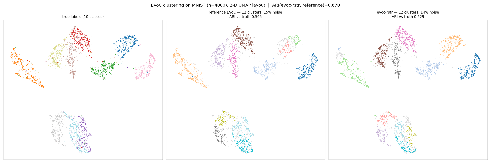

# evoc-rstr

[](https://clojars.org/org.replikativ/evoc-rstr)
[](https://circleci.com/gh/replikativ/evoc-rstr)
[](https://clojurians.slack.com/archives/C09622F337D)

EVoC (Embedding Vector Oriented Clustering) for Clojure, built on
[raster](https://github.com/replikativ/raster) +
[umap-rstr](https://github.com/replikativ/umap-rstr). A port of the reference
[`evoc`](https://github.com/TutteInstitute/evoc) (Tutte Institute / Leland
McInnes) — embed with a UMAP-style layout, then HDBSCAN\*-family clustering with
multi-resolution persistence-based cluster selection. The numeric kernels are
`deftm` functions that JIT-compile to primitive-speed JVM bytecode. The `-rstr`
suffix in the repo/artifact name marks the raster substrate (à la Julia's `.jl`);
the namespace you require is just `evoc`.

## Status — functional

Full pipeline ported and validated against the reference `evoc` 0.3.1: cosine kNN →
fuzzy simplicial set → reproducible node embedding → HDBSCAN\* spine (mutual-reach
MST → condensed tree → labels) → **multi-resolution persistence layer selection** →
`labels_ = argmax(persistence)`.

**Every stage is bit-exact to the reference** on committed gold fixtures (per-stage
regression tests, `test/evoc/gold_test.clj`): MST total weight; condense + labels
(ARI 1.0 on the gold linkage); fuzzy-graph weights; embedding kernel (1 real epoch);
membership strengths; barcode / persistence / peaks / selected layers.

**End-to-end** (EVoC's own test methodology — determinism + ARI, since EVoC is
inherently seed-unstable, not exact-output): on MNIST n=4000, evoc-rstr finds 12
clusters (14% noise) matching the reference's 12 (15%), **ARI(evoc-rstr, reference)
= 0.67** (vs EVoC's cross-seed floor ~0.06), ARI-vs-truth 0.629 (reference 0.595).
See `dev/evoc_{gen.py,compare.clj,plot.py}` for the comparison harness + plot.

Clustering side-by-side on the same 2-D UMAP layout (left: true labels; middle:
reference EVoC; right: evoc-rstr):



**Intentional deviation:** the embedding uses a deterministic random init
(= EVoC's supported `node_embedding_init=None`). The default `label_propagation_init`
(a recursive multilevel graph-coarsening init) is **not ported** — measured to give
no clustering-quality advantage over random at these scales (it's a large-n
convergence/scalability technique), and it can't be bit-reproduced without numpy's
RNG. It remains optional polish if exact default-seed reproduction is ever needed.

## Usage

```clojure
(require '[evoc :as evoc])

;; X: flat row-major double[] (or float[]) of n*dim
(def result (evoc/fit-predict X n dim :k 15 :min-samples 5 :seed 42))
(:labels result)      ;; => int[n] cluster labels (noise = -1)
(:n-clusters result)  ;; => number of clusters found
(:embedding result)   ;; => double[n*2] 2-D layout used for clustering
```

Options: `:k` (neighbors, 15), `:n-epochs` (50), `:min-samples` (5),
`:base-min-cluster-size` (5), `:noise` (0.5), `:max-layers` (10),
`:min-similarity` (0.2), `:seed` (42). The result also carries `:persistence`,
`:layers` (the multi-resolution candidate labelings), and `:strengths`.

## Namespaces

- `evoc.mst` — mutual-reachability MST (Prim + Boruvka switch)
- `evoc.boruvka` — KD-tree Boruvka MST (large n)
- `evoc.tree` — linkage / condensed tree / leaf extraction / labelling
- `evoc.embed` — EVoC node-embedding SGD (reproducible deferred-update epoch)
- `evoc.layers` — multi-resolution persistence layer selection (the defining EVoC feature)
- `evoc` — `fit-predict` orchestrator

kNN / KD-trees / RNG live in raster (`raster.knn`, `raster.spatial.*`); the fuzzy
simplicial set lives in umap-rstr (`umap.graph`).

## Installation

raster (and umap-rstr) depend on a typedclojure fork via git, and git deps
resolve transitively only through `deps.edn` (not a Maven POM), so pin this lib
as a git dependency:

```clojure
io.github.replikativ/evoc-rstr
{:git/url "https://github.com/replikativ/evoc-rstr"
 :git/sha "<sha>"}
```

(Once typedclojure ships its fixes in a Maven release upstream, the whole chain
moves to `org.replikativ/*` Clojars coordinates.)

## Requirements

Valhalla JDK (raster's `deftm` kernels use preview features). Run with `:valhalla`.

```bash
clojure -M:valhalla:test
```

## License

BSD 2-Clause (see `LICENSE` and `NOTICE`).

evoc-rstr is a derivative work — a Clojure / raster port of
[evoc](https://github.com/TutteInstitute/evoc) (© 2024 Tutte Institute for
Mathematics and Computing, BSD 2-Clause). It follows the reference evoc's
algorithm and numerical behaviour (validated bit-exact per-stage against evoc
0.3.1) but is an independent reimplementation, not endorsed by or affiliated with
the original authors. The port is © 2026 Christian Weilbach, released under the
same license.
